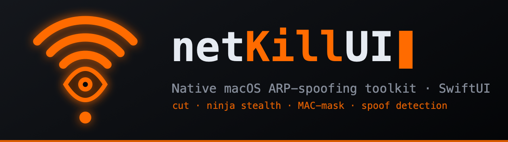

# netKillUI

Нативный инструмент ARP-спуфинга для macOS на Swift — аналог `arpspoof` для
локальной сети с интерфейсом на SwiftUI. По умолчанию **рвёт** связь цели («kill»
в названии); прозрачный MITM — опционально. Без сторонних зависимостей: кадры
инжектятся напрямую в `/dev/bpf*` (Berkeley Packet Filter).

> ## ⚠️ Только авторизованное использование
>
> **netKillUI выполняет ARP cache poisoning**, который перехватывает и может
> разрывать трафик в локальной сети.
>
> - Применяйте **только** в сети, которой владеете, или имея **письменное
>   разрешение** на тестирование.
> - Использование против чужих устройств или сетей без согласия **незаконно** в
>   большинстве юрисдикций и может повлечь гражданскую и уголовную
>   ответственность.
> - Вся ответственность за использование лежит на вас. Авторы не отвечают за
>   неправомерное применение (см. также [`LICENSE`](LICENSE)).
>
> Приложение показывает это предупреждение при каждом запуске. Запуская
> инструмент, вы подтверждаете, что действуете законно и с разрешения.

## Возможности

- **Cut по умолчанию** — спуфинг обрывает трафик цели (IP forwarding **выключен**).
  Доступен прозрачный режим **intercept** (forwarding включён, MITM).
- **Обнаружение устройств** — ARP-скан подсети; хосты появляются сразу, а **имена
  подтягиваются параллельно** через Bonjour/mDNS, с обратным DNS и вендором по OUI.
- **Кеш устройств, online/offline и авто-скан** — известные устройства
  запоминаются **по каждой сети отдельно** (ключ — MAC шлюза, разные сети не
  смешиваются); список сам обновляется раз в 60 с и помечает, кто онлайн, а кто нет.
- **Постоянная блокировка / блок-на-появление** — заблокируй устройство (даже
  оффлайн); блок переживает перезапуск, и устройство режется **в момент
  подключения**, поймано пассивно по его ARP.
- **Привязка к MAC** — цель отслеживается по MAC (стабилен), текущий IP следится
  вживую, так что смена по DHCP не теряет цель.
- **🥷 Режим ниндзя (тихий)** — пассивное обнаружение (без ARP-свипа; плюс чтение
  ARP-кэша ОС) и умеренный темп переотравления. Честно: тихая здесь *разведка* —
  сам ARP-poisoning всё равно детектируется DAI / 802.1X / IDS.
- **🛡 Маскировка MAC** — опционально подменяет аппаратный MAC на правдоподобный
  (OUI вендора + случайный хвост) при старте, чтобы скрыть личность устройства;
  проверяется и честно сообщается. ВАЖНО: на встроенном Wi-Fi Apple Silicon не
  закрепляется — работает на USB-Ethernet. При выходе восстанавливается.
- **Монитор трафика + радар** — режим Monitor на время замера становится
  прозрачным MITM (никого не режем) и измеряет **потребление по устройствам (KB/s)**,
  показывая это и числом, и на анимированном **радаре** в стиле приложения (размер
  блипа ∝ трафику). В ниндзя выключен.
- **Детект чужих ARP-спуферов + активная защита** — пассивно предупреждает, если
  *другое* устройство выдаёт себя за шлюз или за вас, и при атаке на ваш шлюз
  **статически закрепляет** настоящий MAC шлюза в вашем ARP-кэше, чтобы вас нельзя
  было увести (снимается при выходе).
- **Мультицель** — блокировка одного устройства, выборки или всех онлайн сразу.
- **Безопасно by design** — себя и шлюз травить нельзя; ARP-кэши восстанавливаются,
  forwarding выключается при остановке и выходе.
- **Нативный GUI** — SwiftUI, тёмная/светлая темы; терминал не нужен.

## Быстрый старт (приложение)

Собрать `.app` (ad-hoc подпись — Apple Developer ID не нужен):

```sh
./build-app.sh           # создаёт NetKillUI.app
open NetKillUI.app        # или перетащи в /Applications
```

Принять соглашение, затем **Start engine** — macOS один раз спросит пароль
(привилегированный демон работает как root) и сеть просканируется. Клик по
устройству — **заблокировать**. При выходе ARP-кэши восстанавливаются сами.

**Требования:** macOS 13+, Xcode (для сборки). Apple Silicon или Intel.

## Командная строка

Движок работает и отдельно (нужен root для `/dev/bpf*` и `net.inet.ip.forwarding`):

```sh
cd netspoof
swift build -c release

sudo .build/release/netspoof scan                     # список живых хостов + имена
sudo .build/release/netspoof spoof -t <mac|ip>        # одна цель (MITM; --no-forward — обрыв)
sudo .build/release/netspoof serve --socket <path>    # JSON-демон для GUI (по умолчанию рвёт)
```

Опции:

| Опция              | Назначение                                                  |
|--------------------|-------------------------------------------------------------|
| `-i <iface>`       | интерфейс (автоопределение, если не задан)                  |
| `-t <mac\|ip>`     | цель — MAC (рекомендуется) или IP (`spoof`)                 |
| `-g <ip>`          | IP шлюза (по умолчанию — маршрут по умолчанию)              |
| `--oneway`         | травить только цель, не шлюз                                 |
| `--interval <ms>`  | период переотправки ARP (по умолчанию 2000)                 |
| `--no-forward`     | `spoof`: обрыв цели вместо пересылки                         |
| `--intercept`      | `serve`: прозрачный MITM вместо обрыва по умолчанию          |
| `--mask-mac`       | `serve`: маскировать свой MAC при старте (проверка; откат на выходе) |

`Ctrl-C` восстанавливает оба ARP-кэша и выключает forwarding.

## Как это устроено

```
CBPF (C-shim)        ioctl'ы BPF (BIOCSETIF/BIOCIMMEDIATE/BIOCSETF…), шлюз и
                     ARP-кэш через PF_ROUTE, чтение/смена MAC, контроль процессов.
ARPSpoofCore
  MACAddress/IPv4    типы адресов + арифметика по подсети
  NetworkInterface   getifaddrs → MAC/IP/маска, автоопределение интерфейса
  RouteTable         шлюз по умолчанию, ip-forwarding (sysctl)
  ARPPacket          сборка/разбор Ethernet+ARP кадров
  BPFDevice          open /dev/bpfN, inject (write) и capture (poll+read)
  Bonjour/Hostname   имена устройств через mDNS + обратный DNS
  MACMasker          правдоподобный случайный MAC, применение + проверка
  TrafficMeter       учёт байт по MAC поверх прозрачного MITM
  ARPPin             статическое закрепление ARP (защита себя от спуфинга)
  SpoofEngine        мультицель, связки MAC→IP, живое переслеживание, детект спуфера
netspoof (CLI)       scan / spoof / serve
NetKillUI (SwiftUI)  список устройств, блокировка, повышение прав через osascript
```

Механика poisoning: цели говорят «`gatewayIP` на моём MAC» (а при two-way и шлюзу —
«`targetIP` на моём MAC»); кэши обновляются, трафик идёт через наш Mac. В режиме
**cut** forwarding выключен — трафик цели умирает; в **intercept** — пересылается
прозрачно (MITM).

GUI (без прав) запускает `netspoof serve` как root через osascript-диалог
администратора и общается с ним по unix-сокету (JSON построчно). Подпись и Apple
Developer ID не нужны — цена, в отличие от `SMAppService`, это запрос пароля при
старте. Замечание: если демон убит `SIGKILL`, замаскированный MAC восстановится
только при следующем старте.

## Лицензия

MIT с оговоркой об авторизованном использовании — см. [`LICENSE`](LICENSE).

English README: [`README.md`](README.md).
